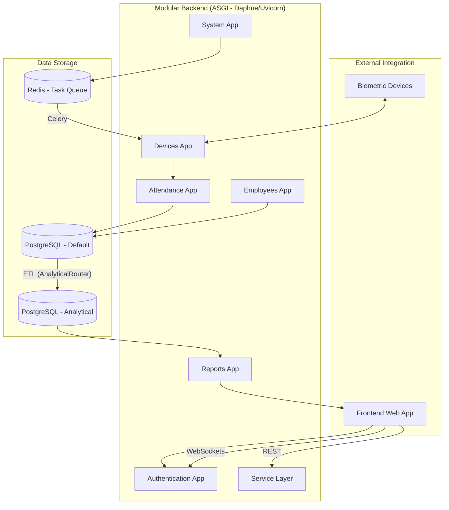

# Project Architecture: HR Companion

HR Companion is built on a **Modular Monolith** architecture. This design balances the simplicity of a single codebase with the maintainability and scalability of decoupled functional modules.

## Architectural Principles

1.  **Domain-Driven Modules**: Each Django application in the `backend/apps/` directory represents a distinct business domain.
2.  **Service Layer Pattern**: Business logic is encapsulated in `services.py` within each app, rather than in `models.py` or `views.py`. This ensures that processing logic is reusable and testable.
3.  **Explicit Data Contracts**: All data entering or leaving a module via API is strictly typed and validated using Serializers.
4.  **Analytical Decoupling**: Transactional data (OLTP) is kept separate from analytical data (OLAP) using a dedicated secondary database (`analytical`) and Django's `DATABASE_ROUTERS`.

---

## App Boundaries & Responsibilities

| App | Responsibility | Key Interactions |
| :--- | :--- | :--- |
| **`authentication`** | User management, JWT token handling, and RBAC permissions. | Provides identity context to all other apps. |
| **`employees`** | Canonical source of truth for employee profiles, departments, and positions. | Referenced by `attendance`, `leaves`, and `reports`. |
| **`attendance`** | Storage of raw biometric logs and calculation of shift adherence. | Consumes data from `devices`; feeds into `reports`. |
| **`devices`** | Low-level integration with biometric hardware (ZKTeco/PLCommPro). | Triggered by `system` commands; pushes logs to `attendance`. |
| **`reports`** | Hosting of pre-aggregated snapshots and analytics facts. | Strictly routes to the `analytical` database. |
| **`leaves`** | Management of leave requests and balances. | Affects `attendance` (absence flags). |
| **`system`** | Global application settings and system monitoring. | Configures behavior for `devices` and `notifications`. |

---

## Data Flow Diagram (ASGI)

---

## The Service Layer

Instead of writing logic in views, we use dedicated Service classes. 
**Example**: `AttendanceService.process_logs()` handles the logic of transforming raw logs into daily attendance records.

**Why?**
- **Testability**: Services can be unit tested without requiring a full HTTP request.
- **Reusability**: The same logic can be triggered by an API view or a background Celery task.
- **Clarity**: Views only handle request parsing and response formatting.

---

## Infrastructural Layer (`backend/shared/`)

While domain logic is modularized, `backend/shared/` provides the cross-cutting infrastructure:
- **Shared API Views**: Base classes for health checks, metrics, and global settings.
- **Structured Logging**: Standardized JSON logging for all services.
- **Middleware**: System-wide request/response processing (e.g., security headers).
- **Utilities**: Common helper functions for system configuration and caching.
