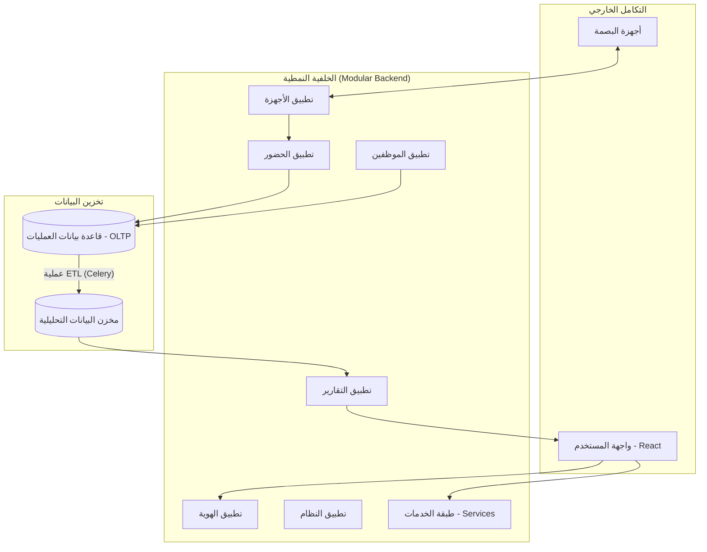

# دليل معمارية النظام: HR Companion

يعتمد مشروع HR Companion على معمارية **المونوليث النمطي (Modular Monolith)**، وهي بنية تجمع بين بساطة المستودع الواحد وقوة الفصل بين الوظائف (Decoupling).

## المبادئ الأساسية للتصميم

1.  **الأنظمة المستقلة (Domain Modules)**: كل تطبيق داخل `backend/apps/` يمثل نطاق عمل محدد ومستقل برمجياً.
2.  **طبقة الخدمات (Service Layer)**: يتم عزل منطق العمل (Business Logic) في ملفات `services.py` لضمان قابلية الاختبار وإعادة الاستخدام.
3.  **عقود البيانات الصريحة (Explicit Contracts)**: يتم تبادل البيانات عبر Serializers محددة بدقة لضمان تكامل النظام.
4.  **فصل البيانات التحليلية**: يتم عزل بيانات التقارير (Analytical store) عن بيئة العمليات الحقيقية (OLTP) لضمان الأداء العالي.

---

## حدود التطبيقات ومسؤولياتها (Boundaries)

| التطبيق | المسؤولية الأساسية | التداخل مع الأنظمة الأخرى |
| :--- | :--- | :--- |
| **`authentication`** | إدارة المستخدمين، هويات JWT، وصلاحيات الوصول (RBAC). | يوفر سياق الهوية لجميع التطبيقات الأخرى. |
| **`employees`** | المصدر الرئيسي لبيانات الموظفين، الأقسام، والمناصب. | مرجع أساسي لـ `attendance` و `leaves` و `reports`. |
| **`attendance`** | تخزين سجلات البصمة الخام، وحساب الالتزام بالدوام والورديات. | يستهلك بيانات من `devices` ويغذي `reports`. |
| **`devices`** | التكامل البرمجي مع أجهزة البصمة (ZKTeco/PLCommPro). | يتم تفعيله عبر `system` ويرسل السجلات لـ `attendance`. |
| **`reports`** | استضافة البيانات المجمعة (Snapshots) ووقائع النظام (Facts). | يقوم بسحب لقطات دورية من `attendance` و `employees`. |
| **`leaves`** | إدارة طلبات الإجازات وأرصدتها. | يؤثر على حالة الحضور في `attendance`. |
| **`system`** | إعدادات النظام العامة، ومراقبة الحالة الصحية للتطبيقات. | يضبط سلوك `devices` و `notifications`. |

---

## أين هو الـ `shared` اليوم؟

تم تحويل `backend/shared/` ليكون الطبقة التحتية (Infrastructural Layer) التي تدعم كافة التطبيقات:
- **النماذج الأساسية**: يحتوي على `TimeStampedModel` لتوفير الوقت التلقائي للإنشاء والتحديث.
- **الأدوات المساعدة (Utilities)**: يوفر دوال مساعدة مشتركة لمعالجة التواريخ، التنسيق، والعمليات الحسابية المتكررة.
- **المكونات المشتركة**: يضم المكتبات البرمجية والتعريفات التي تحتاجها أكثر من تطبيق دون أن تتبع لنطاق عمل محدد.

---

## تدفق البيانات (Data Flow Diagram)

---

## الواجهة البرمجية المعيارية (Canonical API)

تعتبر الواجهة الموجودة تحت المسار `/api/` هي العقد الوحيد المعترف به للتعامل مع النظام. 
- يتم توليد التوثيق تلقائياً في `backend/schema.yml`.
- لا يسمح بالوصول المباشر لقاعدة البيانات من خارج طبقة الـ Serializers.

## طبقة الخدمات (Service Layer)

نحن لا نكتب منطق العمل داخل الـ Views. 
مثال: `AttendanceService.process_logs()` هي المسؤولة عن تحويل البصمات الخام إلى سجلات حضور يومية، بينما يكتفي الـ View باستقبال الطلب وتنسيقه.
