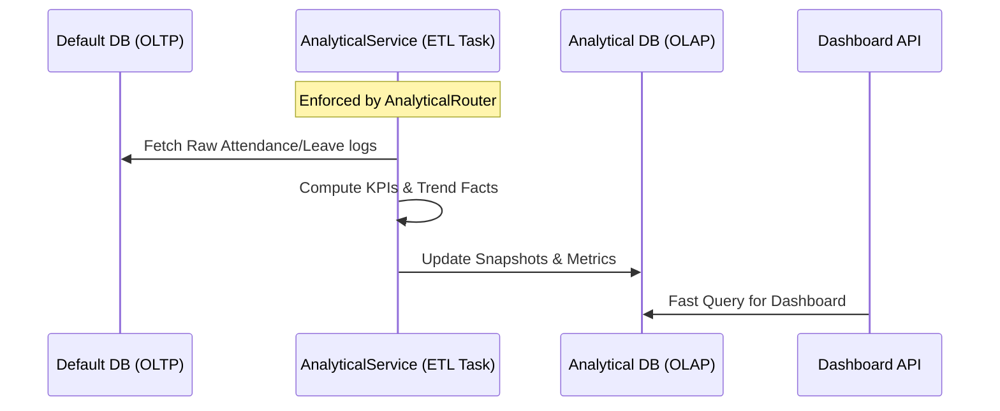

# Data Contracts & Schema Management

This document defines how data is exchanged between components and the strict separation between **Operational (OLTP)** and **Analytical (OLAP)** data layers.

## 1. Canonical API (REST Contract)

The single point of truth for external and frontend communication is the REST API at `/api/`.

- **Contract Definition**: DRF Serializers define the shape of all objects.
- **Documentation**: Generated via `drf-spectacular` into `backend/schema.yml`.
- **Enforcement**: Middleware ensures all responses conform to these structures to prevent breaking frontend types.

---

## 2. OLTP vs. Analytics: The Great Divide (Enforcement)

To maintain a high-performance HR system, we strictly separate transactional data (hiring, punching in/out) from analytical data (dashboard trends, KPIs). This is enforced at the infrastructure level via `DATABASE_ROUTERS`.

### The Operational Store (Default DB)
- **Apps**: `employees`, `attendance`, `leaves`, `authentication`, `system`.
- **Purpose**: Real-time record keeping and business logic execution.
- **Accessibility**: Highly normalized, optimized for single-record lookups and updates.

### The Analytical Store (Analytical DB)
- **Apps**: `reports`.
- **Purpose**: Serving complex dashboards and historical trends without stressing the main database.
- **Accessibility**: Denormalized snapshots and Facts (`MetricTrendFact`, `SystemActivityFact`), optimized for aggregation and range queries.

---

## 3. The ETL Pipeline (Data Exit)

Data "exits" the operational store and enters the analytical store through a **Celery-driven ETL (Extract, Transform, Load)** process, or via the `run_etl_pipeline` management command.

### ETL Flow Details
1.  **Extract**: `AnalyticalService` queries operational tables (`Employee`, `Attendance`, `Leave`) across the database boundary.
2.  **Transform**: Data is aggregated into KPIs and historical trend facts.
3.  **Load**: Results are stored in the `reports` models (`DailyDashboardSnapshot`, `MetricTrendFact`).

---

## 4. UI Models vs. API Contracts

Frontend components do not always use the raw API response. They often map them into **UI Models** for specific libraries (e.g., Recharts, DataGrid).

| API Response (Contract) | UI Model (Adaptation) | Mapping Logic Location |
| :--- | :--- | :--- |
| `MetricTrendFact` | `TrendChartData` | `frontend/src/features/dashboard/mappers.ts` |
| `AttendanceRecord` | `AttendanceCalendarEvent` | `frontend/src/features/attendance/utils/calendar.ts` |
| `DailyDashboardSnapshot` | `KPISummaryCard` | `frontend/src/features/dashboard/api/adapters.ts` |

---

## 5. Metadata Contract (Auditing)
All entities in the system implement standard metadata fields for lifecycle tracking:
- `created_at`: `ISO8601` timestamp of creation (`auto_now_add=True`).
- `updated_at`: `ISO8601` timestamp of the last modification (`auto_now=True`).
- `created_by` / `updated_by`: Foreign key to `authentication.User` (where applicable for audit tracking).
